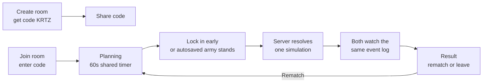

# Greyfall PvP — Room-Code Duels

2026-09-23 · Wan

A focused PRD for the first multiplayer slice: two players, two devices, one
room code, one battle. It extends [PRD.md](PRD.md) and takes priority over it
where the two overlap. Everything outside this document stays as specced there.

## Summary

Two players enter the web app on their own devices. One creates a room and
shares a 6-character code; the other joins with it. Both plan armies at the
same time under a 60-second timer, the server simulates the fight once, and
both clients play back the identical battle. Rematches reuse the room with a
fresh seed.

**The key architectural fact:** battles have zero real-time input, so PvP
needs no netcode. A battle is two army snapshots plus a seed in, a
deterministic event log out. The only live coordination is room state, which
1-2 second polling handles. The pure-function engine already built is what
makes this slice small.

## Goals

- Two humans fight each other from separate devices, over plain browsers.
- The server is authoritative for identity, room state, the armies and the
  official battle result.
- Both players watch the same fight and see the same result, always.
- Stalling, AFK and disconnects are handled by rules, not by anyone waiting.
- Rooms survive a deploy. One Postgres table, so a restart mid-playtest
  does not throw everybody out.

## Non-goals

- Real-time netcode, WebSockets, lockstep or mid-battle state sync.
- Discord Activity integration (this slice runs on plain web; Discord slots in
  later behind the same room object).
- Accounts, OAuth, passwords (guest tokens only for now).
- The 14-round ladder, phantoms, matchmaking pools. PvE stays exactly as it is
  today in the local prototype.
- Best-of-three and session leaderboards (rematch only; a match series is a
  later slice).
- Spectators, replays sharing, chat.

## Player experience



### 1. Identity

First visit, the server issues a random guest token; the app stores it in
localStorage and asks for a display name. Every request carries the token.
Server-issued rather than client-chosen, so a token is a credential and not a
claim anyone can make.
The server pins nothing else to it; no persistence, no profile. Renaming is
free. Clearing storage makes you a new guest.

### 2. Lobby

- **Create room:** the server creates a room holding a random seed and a
  6-character code, and returns the code. Player A shares it verbally or in a
  chat.
- **Join room:** Player B types the code. The server fills the second seat and
  moves the room to planning. A player cannot join a room they already occupy,
  and a full room rejects a third player with a clear message.
- Codes expire with the room (see room lifetime below). Six characters
  rather than four because rooms live for hours and a four-character space is
  small enough to walk: a script could find live rooms and squat the open
  seat. The cost of guessing right is only a griefed duel, so six characters
  and a rate limit on `room.join` is the whole defence needed here.

### 3. Planning (simultaneous, private)

Both devices show the existing setup screen with a shared budget and a
countdown. `room.get` returns `msRemaining`, and the client counts down from
that, re-syncing on every poll. Not an absolute deadline against the device's
own clock: a device a few minutes out would show one player 0:00 while the
other still had forty seconds. No client clock appears in the arithmetic.

- Players place units on their own half of the board.
- **Army autosave:** every board change is sent to the server as an
  idempotent overwrite, debounced so a burst of placements is one write. The
  server always holds each seat's latest army, and validates it on every
  write. Validating only on lock-in would leave an illegal army on the room
  for the deadline to resolve from, and the engine throws on an illegal army
  rather than returning a loss.
- **Lock in:** sets the seat's `locked` flag and ends editing early. Their
  screen shows "Locked, waiting for opponent". A locked player cannot unlock.
- There is one army per seat, not a draft and a separate submission. Locking
  freezes the army already held rather than copying it somewhere else, so
  there is never a question of which of the two a resolution ran from.
- **Nobody sees the opponent's army before resolution.** There is nothing to
  scout in a duel, so `room.get` withholds it as a server rule, not as a
  client courtesy - see the procedure table below. A consequence worth owning:
  planning is simultaneous and blind, so the Warrior/Lancer/Archer counter
  cycle is a guess rather than a read. That is the intended shape of a duel,
  but it carries far less weight here than it does against the AI.

### 4. Timeout and AFK

- When both seats are locked, the server resolves immediately; the timer does
  not need to run out.
- If the deadline passes first, the server resolves using each seat's latest
  army. An AFK player fights with whatever they had built when they stopped.
- If a seat has no legal army at the deadline, the other seat wins by
  walkover and no battle is simulated. This is deliberate: the timer must
  convert stalling and rage-quitting into a server decision rather than a
  wait. A walkover rather than "fields an empty army and loses" because the
  engine rejects an empty army outright - `simulate([], army, seed)` throws
  `army a is invalid: army is empty` - so resolving one would wedge the room
  in planning, which is the exact outcome the timer exists to prevent.
- Both seats empty at the deadline is a draw by walkover.
- Disconnect at any point before resolution leaves the army on the server;
  timeout rules handle it. Reconnecting resumes by polling, since the room,
  not the session, is the unit of truth.

### 5. Resolution

The server re-validates both armies against the engine's rules (budget, board
size, class list), runs `simulate(armyA, armyB, room.seed)`, stores the full
`BattleResult` and both armies on the room, and moves the room to result.
Cost: milliseconds. Neither player waits for a "simulation running" phase; the
next poll already returns the finished fight.

Resolution is wrapped in a try/catch that falls back to a walkover, and moves
the room to result either way. An engine throw must never be able to leave a
room stuck in planning.

Exactly one poll may resolve a room. The write is conditional on the room
still being in planning (see the concurrency note below), so two polls
arriving together after the deadline produce one battle, not two.

### 6. Result and rematch

Both clients poll their way into the result state and feed the stored event
log into the existing BattleScene. Each watches the identical fight on their
own screen, then sees the outcome: winner, units remaining, HP remaining.

- **Draws are a real outcome.** The engine decides a timeout, and a mirror
  match, on HP remaining, and returns `winner: "draw"` when those are level.
  The result screen names it, and a draw offers a rematch like any other
  result.
- **Rematch** resets the room: fresh seed, both armies cleared, both locks
  cleared, back to planning with a new deadline. The room, code and seats
  persist. Arms races between two friends are the expected use, so rematch is
  one tap.
- **Leave** frees the seat and clears that seat's army and lock. A room with
  one seat empty goes back to waiting and can accept a new player by code. If
  the remaining player had locked in, their lock is cleared too: they are
  waiting for an opponent again, not holding a submission against nobody.
- **Clients stop polling once they hold the battle.** A stored `BattleResult`
  is 16KB on average and 29KB at worst, so two clients polling a finished room
  every second would pull that indefinitely for nothing. `room.get` returns
  the battle once; after that the client polls only if it wants to see a
  rematch start, and at a slower interval.

### Room lifetime

Rooms are evicted after 2 hours of inactivity, or immediately when both seats
empty. Eviction is lazy, like resolution: the same poll that touches a room
also runs `delete from rooms where last_activity < now() - interval '2 hours'`.
No cron, no sweeper process.

Rooms survive a restart, which matters most during development: without that,
every deploy ends every live playtest.

## Server design

Same stack as the main PRD: Next.js API routes with tRPC and Zod, plus the
Postgres and Drizzle the main PRD already picks. One table.

An in-memory `Map<code, Room>` was the first plan and is rejected: it pins the
deploy to a single long-running process, which rules out the Vercel option
PRD.md keeps open, and it loses every live room on every deploy.

### The rooms table

One table, and the room object stored whole. `state`, `deadline` and
`last_activity` are columns because eviction and the deadline sweep filter on
them; everything else is only ever read and written whole by code, so it has
no business being a column yet.

```sql
create table rooms (
  code          text primary key,       -- 6 characters, join key
  state         text not null,          -- waiting / planning / result / closed
  deadline      timestamptz,            -- planning deadline, null otherwise
  last_activity timestamptz not null default now(),
  data          jsonb not null          -- the room object below
);
```

| `data` field | Purpose |
| --- | --- |
| `seed` | Regenerated on room creation and on every rematch |
| `seats` | Two seats: `{token, name, army, locked}` or empty |
| `battle` | The stored `BattleResult` once resolved, 16KB typical |

### Concurrency

A single process made the old `Map` race-free by accident: no `await` sat
between a read and its write, so nothing could interleave. A database means
awaits, and therefore real races. Two of them matter, and both close with a
conditional update rather than a transaction:

```sql
-- join: exactly one of two simultaneous callers takes the free seat
update rooms set state = 'planning', data = $2
where code = $1 and state = 'waiting';   -- 0 rows means somebody beat you

-- resolve: exactly one poll past the deadline runs the battle
update rooms set state = 'result', data = $2
where code = $1 and state = 'planning';
```

Check the row count and re-read on 0. That is the whole concurrency story for
this slice.

### tRPC procedures

| Procedure | Type | Purpose |
| --- | --- | --- |
| `room.create` | Mutation | New room, returns code; caller takes seat A |
| `room.join` | Mutation | Enter code, take the free seat |
| `room.get` | Query | Room state **redacted for the caller's seat**; drives all polling |
| `room.setArmy` | Mutation | Idempotent army overwrite during planning; validates |
| `room.lock` | Mutation | Lock in; freezes the army already held |
| `room.rematch` | Mutation | Fresh seed, reset to planning |
| `room.leave` | Mutation | Free the seat |

Every procedure authenticates via the guest token and validates input with
Zod. `room.get` also performs lazy housekeeping: when it observes an expired
deadline on a planning room, it resolves the battle before responding, and it
evicts stale rooms while it is there. No cron, no timers, the poll itself is
the scheduler.

**Redaction is a server rule.** `room.get` returns the opponent's seat as
`{name, locked}` and nothing else while the room is in planning. Their army
and the battle appear only once the room reaches result. This is the one
security-relevant line in the document: hiding the opponent's army in the
client would not hide it at all.

### Validation rules

- Army shape and placement come from the engine's own types; the server calls
  engine functions to check budget, board bounds and class legality. Zod
  checks the envelope; the engine checks the game.
- The resolution seed is the room's stored seed, never derived from
  armies, so neither player can influence the RNG.
- `room.setArmy` is idempotent and validates on every call, not only on
  lock-in. An unvalidated army sitting on a room is a wedged room waiting for
  the deadline, since the engine throws rather than returning a loss.
- `room.setArmy` after locking is rejected, whatever it carries.

## Client design

The existing Next.js + Phaser app gains a mode switch at the top level:
**Local battle** (today's prototype, unchanged) and **PvP**.

| Screen | Existing? | Notes |
| --- | --- | --- |
| Lobby | New | Name entry, create room, join room with code |
| Planning | Adapted from setup screen | Countdown from `msRemaining`, army autosave, lock-in button, waiting state |
| Battle | Exists | Feeds the stored event log into BattleScene unchanged |
| Result | New, small | Winner banner over the battle end state, rematch and leave |

New network behaviour is a single polling loop around `room.get` while in a
PvP room, plus mutations on user actions. Poll at 1s while waiting or
planning, stop once the battle is in hand, and drop to 5s on the result screen
if the client is watching for a rematch. Phaser scenes receive the same event
log they already play back; no engine or scene changes are required.

## Milestones

| # | Slice | Done when |
| --- | --- | --- |
| 1 | Server room core | `room.create/join/get` against the rooms table; two browsers can occupy one room and see each other's presence |
| 2 | Planning | The countdown agrees on both devices; armies autosave and validate; lock-in and timeout both produce two frozen armies |
| 3 | Battle and result | Server resolves via the engine; both clients play the same event log; rematch works |
| 4 | Hardening | Disconnect, refresh mid-planning, deadline races, double joins, walkovers and redaction all covered by tests; eviction works |

Milestone 3 is the first playable version; the slices are independently
demoable.

## Testing

- Engine validation paths: army rejection (over budget, off board, unknown
  class) at the server boundary, on every `room.setArmy` and again at
  resolution.
- Determinism: the same room seed and armies resolve to the same winner and
  event log on repeated resolution.
- Timeout: deadline expiry resolves from the autosaved armies with neither
  seat locked in.
- Walkover: a seat with no army at the deadline loses without the engine
  being called; both empty is a draw; an engine throw still lands the room in
  result rather than wedging it in planning.
- Redaction: `room.get` never returns the opponent's army while the room is in
  planning, for either seat.
- Race safety: two `room.join` calls on a one-seat room admit exactly one; two
  polls arriving together past the deadline produce one battle; `room.setArmy`
  after lock-in is rejected.
- Draw: a mirror match resolves as a draw and the result screen says so.
- Lifecycle: eviction after inactivity; rematch regenerates the seed and
  clears both armies and locks; leaving while locked clears the lock.

## What this unlocks next

- **Discord Activity presence** replaces room codes with the voice-channel
  participant list; the room object and flow stay identical.
- **A `battles` table** split out of the room's `data` turns rematch history
  into shared results and replay links. Deliberately not done here: nothing in
  this slice reads a battle except the two players watching it once.
- **Best-of-three and the parallel ladder** from the main PRD build directly
  on stored battles per room.
- **Phantom matchmaking** reuses the same army-plus-seed shape that PvP just
  proved out, with an AI seat instead of a second human.
