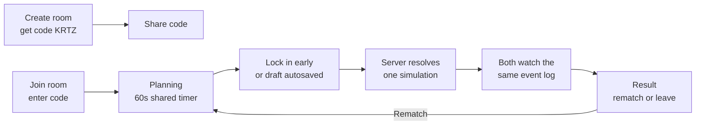

# Greyfall PvP — Room-Code Duels

2026-09-23 · Wan

A focused PRD for the first multiplayer slice: two players, two devices, one
room code, one battle. It extends [PRD.md](PRD.md) and takes priority over it
where the two overlap. Everything outside this document stays as specced there.

## Summary

Two players enter the web app on their own devices. One creates a room and
shares a 4-character code; the other joins with it. Both plan armies at the
same time under a 60-second timer, the server simulates the fight once, and
both clients play back the identical battle. Rematches reuse the room with a
fresh seed.

**The key architectural fact:** battles have zero real-time input, so PvP
needs no netcode. A battle is two army snapshots plus a seed in, a
deterministic event log out. The only live coordination is room state, which
1-2 second polling handles. The pure-function engine already built is what
makes this slice small.

## Goals

- Two humans fight each other from separate devices, over plain browsers.
- The server is authoritative for identity, room state, submissions and the
  official battle result.
- Both players watch the same fight and see the same result, always.
- Stalling, AFK and disconnects are handled by rules, not by anyone waiting.
- Ship without a database; add one later without changing the flow.

## Non-goals

- Real-time netcode, WebSockets, lockstep or mid-battle state sync.
- Discord Activity integration (this slice runs on plain web; Discord slots in
  later behind the same room object).
- Accounts, OAuth, passwords (guest tokens only for now).
- The 14-round ladder, phantoms, matchmaking pools. PvE stays exactly as it is
  today in the local prototype.
- Best-of-three and session leaderboards (rematch only; a match series is a
  later slice).
- Spectators, replays sharing, chat.

## Player experience

### 1. Identity

First visit, the app generates a random guest token, stores it in
localStorage, and asks for a display name. Every request carries the token.
The server pins nothing else to it; no persistence, no profile. Renaming is
free. Clearing storage makes you a new guest.

### 2. Lobby

- **Create room:** the server creates a room holding a random seed and a
  4-character code, and returns the code. Player A shares it verbally or in a
  chat.
- **Join room:** Player B types the code. The server fills the second seat and
  moves the room to planning. A player cannot join a room they already occupy,
  and a full room rejects a third player with a clear message.
- Codes expire with the room (see room lifetime below). No code guessing
  matters: joining an unknown code is a form error, not a leak.

### 3. Planning (simultaneous, private)

Both devices show the existing setup screen with a shared budget and a
countdown rendered from the server's absolute deadline
(`deadline - clientNow`). The server timestamp is the single source of truth;
client clocks are never trusted.

- Players place units on their own half of the board.
- **Draft autosave:** every board change is sent to the server as an idempotent
  draft overwrite. The server always holds each player's latest draft.
- **Lock in:** ends the player's editing early. Their screen shows "Locked,
  waiting for opponent". A locked-in player never sees the opponent's army
  before resolution; there is nothing to scout in a duel, so all information
  stays hidden until the fight.
- A locked player cannot unlock. This keeps resolution simple: two snapshots
  in, one fight out.

### 4. Timeout and AFK

- When both snapshots exist, the server resolves immediately; the timer does
  not need to run out.
- If the deadline passes first, the server resolves using each player's latest
  draft. An AFK player fights with whatever they had built when they stopped.
- If a player has an empty draft at the deadline, they field an empty army and
  lose. This is deliberate: the timer must convert stalling and rage-quitting
  into a server decision rather than a wait.
- Disconnect at any point before resolution leaves the draft on the server;
  timeout rules handle it. Reconnecting resumes by polling, since the room,
  not the session, is the unit of truth.

### 5. Resolution

The server validates both snapshots against the engine's rules (budget, board
size, class list), runs `simulate(snapshotA, snapshotB, room.seed)`, stores
the full `BattleResult` and both snapshots on the room, and moves the room to
result. Cost: milliseconds. Neither player waits for a "simulation running"
phase; the next poll already returns the finished fight.

### 6. Result and rematch

Both clients poll their way into the result state and feed the stored event
log into the existing BattleScene. Each watches the identical fight on their
own screen, then sees the outcome: winner, units remaining, HP remaining.

- **Rematch** resets the room: fresh seed, back to planning, new deadline. The
  room, code and seats persist. Arms races between two friends are the
  expected use, so rematch is one tap.
- **Leave** frees the seat. A room with one seat empty goes back to waiting
  and can accept a new player by code.

### Room lifetime

Rooms live in memory and are evicted after 2 hours of inactivity, or
immediately when both seats empty. A server restart loses rooms; players see
"room closed" and create a new one. Acceptable for this slice; persistence is
the follow-up, not a redesign.

## Server design

Same stack as the main PRD: Next.js API routes with tRPC and Zod, run from the
one server process. No database in this slice; an in-memory `Map<code, Room>`
is the whole store.

### Room object

| Field | Purpose |
| --- | --- |
| `code` | 4 characters, join key |
| `seed` | Generated at room creation, reused on rematch regeneration |
| `state` | `waiting` / `planning` / `result` / `closed` |
| `players` | Two seats: `{token, name}` or empty |
| `deadline` | Absolute planning deadline timestamp |
| `drafts` | Per-seat latest army snapshot, autosaved |
| `submissions` | Per-seat locked army snapshot, immutable |
| `battle` | The stored `BattleResult` once resolved |
| `lastActivity` | For eviction |

### tRPC procedures

| Procedure | Type | Purpose |
| --- | --- | --- |
| `room.create` | Mutation | New room, returns code; caller takes seat A |
| `room.join` | Mutation | Enter code, take the free seat |
| `room.get` | Query | Full room state for the caller's seat; drives all polling |
| `room.submitDraft` | Mutation | Idempotent draft overwrite during planning |
| `room.submit` | Mutation | Lock in; validates and freezes the snapshot |
| `room.rematch` | Mutation | Fresh seed, reset to planning |
| `room.leave` | Mutation | Free the seat |

Every procedure authenticates via the guest token and validates input with
Zod. `room.get` also performs lazy housekeeping: when it observes an expired
deadline on a planning room, it resolves the battle before responding. No
cron, no timers, the poll itself is the scheduler.

### Validation rules

- Army shape and placement come from the engine's own types; the server calls
  engine functions to check budget, board bounds and class legality. Zod
  checks the envelope; the engine checks the game.
- The resolution seed is the room's stored seed, never derived from
  submissions, so neither player can influence the RNG.
- Submission is idempotent: a repeat `room.submit` with the same snapshot
  succeeds silently; a different snapshot after locking is rejected.

## Client design

The existing Next.js + Phaser app gains a mode switch at the top level:
**Local battle** (today's prototype, unchanged) and **PvP**.

| Screen | Existing? | Notes |
| --- | --- | --- |
| Lobby | New | Name entry, create room, join room with code |
| Planning | Adapted from setup screen | Deadline countdown, draft autosave, lock-in button, waiting state |
| Battle | Exists | Feeds the stored event log into BattleScene unchanged |
| Result | New, small | Winner banner over the battle end state, rematch and leave |

New network behaviour is a single polling loop around `room.get` while in a
PvP room, plus mutations on user actions. Phaser scenes receive the same event
log they already play back; no engine or scene changes are required.

## Milestones

| # | Slice | Done when |
| --- | --- | --- |
| 1 | Server room core | `room.create/join/get` with in-memory store; two browsers can occupy one room and see each other's presence |
| 2 | Planning | Shared deadline renders on both devices; drafts autosave; lock-in and timeout both produce two frozen snapshots |
| 3 | Battle and result | Server resolves via the engine; both clients play the same event log; rematch works |
| 4 | Hardening | Disconnect, refresh mid-planning, deadline races and double submissions all covered by tests; eviction works |

Milestone 3 is the first playable version; the slices are independently
demoable.

## Testing

- Engine validation paths: snapshot rejection (over budget, off board, unknown
  class) at the server boundary.
- Determinism: the same room seed and snapshots resolve to the same winner and
  event log on repeated resolution.
- Timeout: deadline expiry resolves from drafts without any submission.
- Race safety: two `room.join` calls on a one-seat room admit exactly one;
  `room.submit` after lock-in with a different snapshot is rejected.
- Lifecycle: eviction after inactivity; rematch regenerates the seed.

## What this unlocks next

- **Discord Activity presence** replaces room codes with the voice-channel
  participant list; the room object and flow stay identical.
- **Postgres persistence** (`rooms`, `battle` rows) turns rematch history
  into shared results and survives deploys.
- **Best-of-three and the parallel ladder** from the main PRD build directly
  on stored battles per room.
- **Phantom matchmaking** reuses the same snapshot-plus-seed shape that PvP
  just proved out, with an AI seat instead of a second human.
