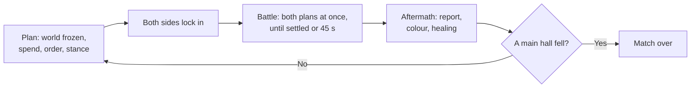
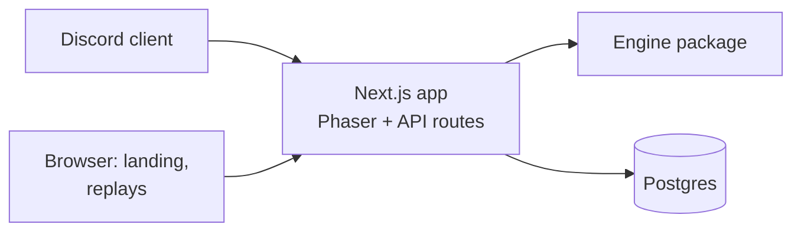

# Greyfall - Product Requirements Document

2026-09-21 · Wan · revised 2026-09-25: the game moves onto the strategic map, played in plan and battle phases

## Overview

Greyfall is a strategy game with a Dark Souls mood that runs as a Discord Activity. It mixes Warcraft and auto chess: two sides share one island, each builds a town, trains an army from a fixed roster like Warcraft's, and fights for the island in rounds.

Each round, both sides plan in secret while the world is paused. Then both plans play out at the same time, and fights break out wherever armies meet. Rounds repeat until a main hall falls. A solo match lasts about 15 minutes, a duel about 20, and solo is played against an AI. It is also the showcase project for Wan's skills across the whole stack.

**Goals**

- Ship a playable, polished game inside Discord that friends can launch from a voice call.
- Show depth across the whole stack: a simulation the server decides, login, saved games, matchmaking and deployment.
- Work with zero existing players, using an AI opponent that plays by the same rules.

**Non-goals**

- Live control: nothing is commanded during a battle phase. Both sides plan at the same time, never in real time.
- Random shops, item systems, or monetisation in the MVP.
- Fog of war in the MVP; the whole island is visible while planning.
- Phone apps outside Discord.
- Custom art beyond the free Tiny Swords pack and effects made in code.
- Balance analytics and a simulation dashboard; possible after launch.

## Theme and setting

The world has been drained of colour by the Greying, a curse that hollows everything it touches. The player is the Keeper of the last bonfire, rebuilding a kingdom around its flame and pushing the grey back.

- **Colour as reward:** The island starts in greyscale, except the player's home plateau. Colour returns to each region the player holds, so a won match looks like the bright original art.
- **Tone:** Sparse, melancholy writing in the style of FromSoft item descriptions, set against cheerful sprites.
- **Death screen:** "THE GREY TAKES YOU" when the player's main hall falls.
- **Victory:** The land is reclaimed when the enemy main hall falls.

**Covenants (factions)**

| Colour | Covenant | Identity |
| --- | --- | --- |
| Blue | Tidewardens | Protection and shields |
| Red | Emberkin | Fire and burn damage |
| Yellow | Dawnsworn | Healing and light |
| Purple | The Unwritten | Evasion; the order of Caedmon |
| Black | The Forsaken | Not playable in the MVP |

## Core gameplay loop

Each round is plan, then watch, as in auto chess, but on a Warcraft map.

- **Plan:** the world is frozen. The player spends gold, gives orders and picks each unit's stance.
- **Battle:** when both sides lock in, both plans play out together across the island. Nobody can give orders until the fighting settles.
- **Aftermath:** a short summary, then the next round.

Rounds repeat until a main hall (the castle) is destroyed.

In a duel, planning has a timer of 60 seconds. Solo play has no timer. A battle phase lasts at most 45 seconds and can be sped up 2x. A match usually ends by round 8 to 12.

**Round flow**

1. **Income:** 10 gold, plus 2 gold for each Pawn gathering at a mine that still holds gold.
2. **Read the island:** every unit and building is visible, the enemy's included. The enemy's orders and stances are not.
3. **Spend:** train units, train Pawns, build, upgrade.
4. **Order:** give each unit or group an order. Orders persist across rounds until done or replaced.
5. **Stance:** pick how each unit or group reacts once the battle starts (below). Most players leave the default.
6. **Lock:** in solo, the AI has already planned. In a duel, the battle starts when both players lock or the timer runs out.
7. **Battle:** both plans run together. Units follow their orders and stances and fight whatever they meet.
8. **Aftermath:** a round report (losses, gold mined, buildings damaged), colour returns to held regions, and units at home heal.

**Why phases**

- It is the auto chess half of the idea: every decision happens before the battle, and the battle shows whether the decisions were good. Whole fights play out and none is cut off halfway.
- A round is one bigger decision rather than many small ones, which is comfortable on a phone inside Discord and keeps a duel near 20 minutes.
- The skill moves into setup, the way placing units on the board works in auto chess: where units go, plus the stance they fight in.
- A round with no attack orders settles almost at once. That is an economy round, a legitimate choice, not a wasted minute.

## Game systems

As in Warcraft, the full roster is always available. Strategy comes from economy, supply, tech, position, stances and counters, not from luck in a shop. All numbers below are starting values, kept in one config file for tuning.

### Orders

The order decides where a unit goes and how far it will go after an enemy.

| Order | Who | Behaviour |
| --- | --- | --- |
| Attack move | Fighters | Walk to a tile. Fight any enemy that comes in range, chasing up to 3 tiles off the path, then carry on. The default order. |
| Move | All | Walk to a tile, ignoring enemies and taunts. Used to retreat or to slip past. |
| Attack | Fighters | Walk to a chosen unit or building and attack it, following it anywhere. |
| Hold | Fighters | Stay on the tile and fight whatever comes in range. Never moves. A Hold on a ramp moves to the nearest tile beside it, so no unit blocks a ramp. |
| Gather | Pawn | Walk to a gold mine and dig there. Income is paid per round, so nothing is carried home. |
| Stop | All | Clear the order. The unit guards its tile: it fights enemies within 3 tiles, then goes back. |

Orders go to one unit or a selected group. A group order sends each unit along its own path to tiles around the target.

### Stances

Orders already set how far a unit chases, so the stance answers the one question they leave open: what a unit does when it is losing. It is a single toggle on the command card, and it persists across rounds like an order.

| Stance | Behaviour | On screen |
| --- | --- | --- |
| Stand firm (default for fighters) | Fights until it dies | No badge |
| Fall back (default for Pawns) | Below 50% HP, turns and runs to its home plateau, and stops fighting | A badge over the unit; it runs home with its run animation |

- A unit that falls back heals to full in the aftermath, since it ends the round at home. It costs a fighter for the rest of that battle; standing firm risks losing it for good.
- The round report says why a unit left ("Warrior fell back at 42% HP").
- Units target the nearest enemy, ties to the lowest HP. Only an Attack order or a Lancer's taunt overrides it. There is no target priority setting.
- The 50% threshold is a number in `balance.ts`.

**Why only two.** An earlier draft had four presets (Aggressive, Defensive, Hold, Cautious), and they repeated each other:

- Three of the four differed only in how far a unit chases, which the order already decides. Hold was both an order and a stance.
- The art cannot show the difference. Units have only idle, run and attack poses, plus guard for some; nothing looks "aggressive" or "defensive", so a player watching the battle could not tell them apart.
- Falling back is the one behaviour that reads at a glance: a unit turns and runs home. It is also the one choice orders cannot express, because it depends on HP during the fight.

This keeps the command card to one grid of 3x3: Attack move, Move, Attack, Hold, Stop, Gather, the stance toggle, Build, and one slot spare.

### The island

- A 32x20 grid of 64px tiles with three levels: water, lowland and plateau. Plateaus are reached only by ramps, so ramps are natural chokepoints.
- All units walk 1 tile per second; crossing from one base to the other takes about 25 seconds, so a single battle phase fits a march and a fight.
- Friendly units walk through each other but never stop on the same tile. Enemies block, so a line of enemies really holds a ramp. Stricter rules (one unit per tile, with swaps) deadlock the one-tile ramps.
- Buildings cover the tiles under their base (castle 3x2, production buildings 2x1, houses 1x1). Nobody walks through them. Red's plateau is half the size of blue's, which is why production footprints are one row deep.
- **High ground:** an attack from lowland against a unit on a plateau deals 25% less damage. No roll, so it stays deterministic.
- **Regions:** the island is divided into named regions (each plateau, each stretch of lowland). A player holds a region at the end of a battle phase if only their units stand in it. Held regions show in colour.
- **Gold mines:** one beside each base and one contested on the eastern lowland, 17 steps from each castle. The lake between the bases has no shore to stand on.

### Starting position

Each side starts on its home plateau with a castle, a barracks, 2 Pawns gathering at the home mine and 10 gold, so 2 of 6 supply is used. Round 1's income arrives on top, so the first plan has 24 gold.

### Economy

- Base income: 10 gold per round, paid at the start of every round including the first. Unspent gold carries over.
- Pawns cost 3 gold and 1 supply. A Pawn gathering at a mine earns 2 gold per round, paid at the start of the round, so it pays for itself in two rounds. Income is per round rather than per trip so a short battle phase does not starve anyone; Pawns still walk and mine on the map during the battle.
- A mine pays nothing for a round if an enemy fighter stands within 2 tiles of it at the end of that round's battle phase. Raiding a mine stops its income without killing a Pawn.
- A mine takes up to 3 Pawns at once. Home mines hold 60 gold, the middle mine 120, so a home mine runs dry around round 10 and a long match has to fight over the middle.
- The trade-off: early Pawns make a stronger later army at the cost of a weaker early one.

### Supply

- Starting supply cap: 6. Every unit and Pawn uses 1 supply; a unit that dies frees its supply.
- A house costs 4 gold and adds 3 supply. Hard cap: 15 supply.

### Buildings and upgrades

Buildings unlock classes and upgrade them.

- **Plots:** each side has 8 fixed plots on its home plateau: castle, barracks, archery range, tower, monastery and 3 houses. One of each building; a plot takes only its own building.
- **Building:** paid in gold while planning; no Pawn is needed. A new building or upgrade finishes at the end of that round's battle phase.
- **Training:** a building trains up to 2 units per round, 3 once it reaches level 2. They appear on the free tiles beside it at once, so they can take orders in the same plan. A new Pawn goes straight to its home mine while it has room.
- **HP:** the castle, the main hall, has 1000 HP; the rest have 300. Buildings do not attack and cannot be repaired. That is enough that a small army marching from home cannot raze an undefended castle inside one battle phase, so the defender always gets a plan to answer a siege.
- **Damage to buildings:** units deal half their damage to buildings, from any tile in range of the building's base. Five Warriors take about 29 seconds to bring down an undefended castle, so with the march it takes two rounds.
- **Destroyed:** a building loses its levels and can be rebuilt on its plot. Units of its class stay, but no more can be trained until it stands again.
- **Upgrades** apply at once to every unit of that class, including those already in the field.

| Building | Unlocks | Build cost | Level 2 | Level 3 |
| --- | --- | --- | --- | --- |
| Barracks | Warrior | Already built | 6 gold: +20% HP | 10 gold: Guard ability |
| Archery range | Archer | 4 gold | 6 gold: +1 range | 10 gold: piercing arrows |
| Tower | Lancer | 4 gold | 6 gold: +20% HP | 10 gold: Taunt ability |
| Monastery | Monk | 5 gold | 6 gold: +30% healing | 10 gold: revive one ally per round |
| Castle | Level 3 upgrades | Already built | 8 gold: unlocks level 3 everywhere | None |
| House | +3 supply | 4 gold | None | None |

### Units

| Class | Cost (gold) | HP | Damage | Range (tiles) | Role |
| --- | --- | --- | --- | --- | --- |
| Pawn | 3 | 40 | 4 | 1 | Miner; weak filler if sent to fight |
| Warrior | 3 | 120 | 14 | 1 | Melee damage |
| Lancer | 3 | 140 | 10 | 1 | Tank that holds the front line |
| Archer | 3 | 60 | 10 | 3 | Ranged damage |
| Monk | 4 | 70 | 0 | 2 | Heals the ally missing the most HP for 8 |

HP carries over between rounds. In the aftermath, units standing on their home plateau heal to full; units out in the field keep their damage, so holding forward ground has a cost. During a battle, only Monks heal.

### Counters

- Lancer beats Warrior, Warrior beats Archer, Archer beats Lancer.
- A unit deals +25% damage to the class it counters.
- Monks counter nothing and are countered by nothing.

### Factions

The player picks one covenant at the start of a match; all their units use that colour. Each covenant has one passive, strengthened when the castle reaches level 2.

| Covenant | Passive | At castle level 2 |
| --- | --- | --- |
| Tidewardens (blue) | Units start each battle phase with a 15 HP shield | 25 HP shield |
| Emberkin (red) | Attacks burn for 3 damage per second over 3 seconds | 5 damage per second |
| Dawnsworn (yellow) | +20% healing received | +35% |
| The Unwritten (purple) | 10% chance to dodge attacks | 18% |

### Monster tribes

The other side of the island is the Greying's host, drawn from the pack's Enemy Pack. Knights and monsters are mirrors: each monster fills a knight class's role with the same cost, stats and counters, so the balance table stays one table and only the sprites differ. Both grow stronger by upgrading buildings with the same bonuses. Knights keep their sprite. A monster changes body only where the art has a next tier (Spear Goblin to Pig Rider); otherwise an upgraded monster gets a tint and a slightly larger sprite.

Each covenant has a mirror tribe whose passive works the same way at the same strength:

| Role | Knights | Goblin Warband (mirrors Emberkin) | Tidal Brood (mirrors Tidewardens) | The Hollowed (mirrors Dawnsworn) | The Wilds (mirrors The Unwritten) |
| --- | --- | --- | --- | --- | --- |
| Melee | Warrior | Torch Goblin | Paddle Shark | Skull | Lizard |
| Tank | Lancer | Spear Goblin, then Pig Rider | Turtle | Minotaur | Panda |
| Ranged | Archer | Slingshot Gnome | Harpoon Shark | Gnoll | Giant Bat |
| Support | Monk | Imp | Bomb Fish | Hex Shaman | Spider |
| Worker | Pawn | Gnome | Gnome | Thief | Gnome |

| Tribe | Passive | Mirrors |
| --- | --- | --- |
| Goblin Warband | Attacks burn | Emberkin burn |
| Tidal Brood | Units start each battle phase with a shell that absorbs damage | Tidewardens shield |
| The Hollowed | Attacks drain health back to the attacker | Dawnsworn healing received |
| The Wilds | Chance to dodge attacks | Unwritten dodge |

**Buildings**

| Knight | Monster |
| --- | --- |
| Castle | Cave |
| Barracks | Goblin Hut |
| Archery range | Gnome Tower |
| Tower | Pirate Tower |
| Monastery | Dead Tree |
| House | Gnome Hut, Fish Hut |

Monster buildings come in one colour only, so restoring colour is the knights' reward alone.

**Left over:** Troll is the boss (its wind-up, recovery and death sheets make a telegraphed attack). Bear, Snake and Bumblebee are later tiers for the Wilds or neutral creep camps. Hex Shaman's Transformation Spell plus the Pig sprite already make a Hex.

**Known gaps in the art**

- Only Gnoll, Harpoon Shark, Slingshot Gnome, Hex Shaman and Bomb Fish have projectiles; Giant Bat and Spider need their ranged and support effects drawn in code.
- No monster has gathering or carrying animations, so monster Pawns gather with a sack drawn in code over the run animation.
- Tanks with a guard sheet for Taunt: Turtle, Minotaur, Panda (Skull has one too, used for Guard). Spear Goblin and Pig Rider have none.

### Battle phase simulation

- Runs on the server at 10 ticks per second with a seeded random number generator. The same state, the same two plans and the same seed always produce the same next state.
- The engine is `battle(state, planA, planB)`, with the seed kept in the match state: the new state plus an event log that the client plays back on the map. A plan is the round's purchases, orders and stances.
- **Settled:** the phase ends once no unit is still walking to a destination and no unit has fought for 3 seconds. Gathering, holding and guarding units count as done, and so does a unit that has made no progress for 3 seconds, so one stuck unit never holds a battle open. **Cap:** 45 seconds. A fight still running at the cap freezes where it stands and carries on next round; this should be rare.
- Movement follows the island's paths, ramps included. Units act in id order within a tick; blue's ids are odd and red's even, so two plans made from the same state never mint the same id.
- In combat, a unit targets enemy units before buildings, nearest first; ties go to the lowest HP, then id. When every side of its target is taken it tries the next, so it never freezes in front of an unreachable one. Melee strikes only on its own level or along a ramp, never across a cliff's side; ranged units shoot up and down cliffs. Each unit's first action in a battle phase is delayed by a seeded 0-1 s so armies do not swing in lockstep.
- Monks heal the ally missing the most HP in range.
- Abilities, one per class, unlocked by the level 3 upgrade (`BALANCE.abilities.*.enabled`):
  - Guard (Warrior): once per round, below 50% HP, spends an action to take half damage for 3 seconds.
  - Taunt (Lancer): always on; enemies within 2 tiles, except those on a Move order, must attack the nearest Lancer, and target anyone else only when no Lancer can be hit or reached.
  - Piercing (Archer): every 3rd shot also hits the enemy directly behind the target, along the line of fire, for half damage.
  - Revive (Monk): once per round, spends an action raising the first ally to fall that round, at 50% HP, if its tile is free.
- Random rolls are limited to the first-action delay above and to dodge and burn procs.

### Win and lose

Rounds repeat until a main hall falls. There is no round cap and no win on points.

- **Win:** destroy the enemy main hall. Both falling in the same battle phase is a draw.
- **The Greying closes in:** from round 12, the grey gnaws at both main halls at the end of every battle phase, for 5% of their max HP, growing by 5% each round (5%, 10%, 15%, ...). It hits both sides equally, so whoever has already damaged the other hall wins the race, and no match outlasts round 17. On the map, grey creeps back over the island from its edges, so the clock reads without a number.
- **Concede** at any time. In a duel, a player who misses the planning timer three rounds in a row forfeits.

Most matches should end by round 8 to 12 through real attacks. The Greying only decides matches where both sides played it safe.

## Opponents

**AI (solo)**

The AI plans each round with the same actions and rules as the player, and never sees the player's orders. It plays the monster tribe that mirrors the player's covenant.

- Economy first: Pawns up to its home mine's limit, then houses as supply runs out.
- Builds and upgrades by its tribe's preferred army, with some seeded variation so no two matches open the same way.
- Attacks when its army's value is clearly larger than the player's visible army, defends when enemies step onto its plateau, and contests the middle mine when ahead or when its home mine runs low. It uses Fall back for its wounded front line and Hold orders for archers on high ground.

**Duel**

Two players share an island, each planning in secret. The server runs the battle phase when both lock in or the planning timer runs out; a player who never locks keeps their standing orders and stances. The existing duel rooms (code, seats, deadline, one resolution per round) carry over in shape: a room round becomes a match round.

## Discord and social

Greyfall launches from a Discord voice channel as an Activity. Everyone in the call can play solo against the AI or pair up for duels.

**Finding an opponent**

1. A player in the same Activity session who is also looking for a duel.
2. The AI, which is always available, so the game is fully playable with one player.

Saved phantom armies are dropped: a saved army cannot answer your moves round by round.

**Social features**

- Session results screen showing who beat whom, visible to everyone in the Activity.
- Shareable replay links; a replay is the starting state, the seed and every round's plans. Posting one in chat unfurls into a preview card.
- A global leaderboard by fewest rounds to beat the AI.

**Later, not MVP**

- Slash commands such as `/greyfall stats` and a daily seeded island with a server leaderboard.
- Lobby presence showing who is planning and who is watching a battle.
- Fog of war, with scouting as its counter.

## Art and assets

All art comes from the [Tiny Swords](https://pixelfrog-assets.itch.io/tiny-swords) free pack by Pixel Frog; missing animations are produced in code. The inventory below was checked against the files in [nauqh/pixel-knight](https://github.com/nauqh/pixel-knight).

**Asset use**

| Asset | Used for |
| --- | --- |
| Warrior, Lancer, Archer, Monk, Pawn in 5 colours | The 25 unit variants |
| Warrior guard, Lancer defence poses | Guard and Taunt abilities |
| Archer arrow, Monk heal effect | Projectiles and healing |
| Pawn tool animations (pickaxe, axe, hammer) | Mining and building on the island |
| 8 buildings in 5 colours | Buildings on their plots; each production building is its class's shop |
| Terrain tilesets, water, decorations, gold stones | The island, autotiled from its height map |
| Fire, explosion and dust effects | Deaths and burn damage |
| Ribbons, banners, bars, buttons, papers, wood table | All UI: the HUD in the style of Warcraft, HP bars, result banners |
| 25 human avatars | Unit portraits in the selection panel |

**Missing animations and code replacements**

- **Hit:** a 100 ms white flash plus a small shake, using Phaser tint and tweens.
- **Death:** tint grey, fade out while floating upward, and play a dust puff, read as a soul leaving.
- **Damage numbers:** text in a pixel font that floats and fades.
- **Greyscale world:** a Phaser colour matrix filter, lifted region by region as the player holds them, and drawn back in from the edges once the Greying closes in.
- **Planned orders:** while planning, each selected unit shows its path and destination as a dotted line and flag, and its stance as a badge.

**Technical notes**

- Lancer frames are 320px wide; other units are 192px. Normalise scale per class.
- Only the Lancer has directional poses. Other units face left or right by flipping horizontally.
- Animations run at 10 frames per second to match the pack.

**License**

- The current free pack allows commercial use and modification but forbids redistribution, so the files must not be in the public repo.
- Assets live in a private bucket and are downloaded during CI builds; the README tells contributors where to get them.
- The pixel-knight repo currently includes the pack files and should be fixed the same way, or switched to the old version of the pack, which is CC0.

## Technical architecture

Greyfall is a TypeScript monorepo with one Next.js app and a shared game engine; the server is authoritative for every purchase and every battle phase.

**Stack**

| Layer | Choice | Notes |
| --- | --- | --- |
| Monorepo | pnpm workspaces | `packages/engine`, `apps/web` |
| Engine | Pure TypeScript, no dependencies | Island grid and pathing, economy, orders and stances, battle phase, AI, seeded RNG |
| Tests | Vitest, fast-check | Unit tests and property tests on the engine |
| Client | Phaser inside Next.js | Loaded with `ssr: false`; destroyed on unmount |
| Discord | Embedded App SDK | OAuth sign-in; relative URLs for Discord's proxy |
| API | tRPC on Next.js, Zod | End-to-end types; Zod schemas as procedure inputs |
| Database | Postgres, Drizzle ORM | Neon serverless driver if on Vercel |
| Hosting | Railway | One long-running Next.js server; Vercel as alternative |
| CI | GitHub Actions | Type check, tests, build; assets pulled from a private bucket |

**Key rules**

- The engine is a pure function: state plus both sides' plans in, new state plus events out. The client never decides outcomes.
- Planning actions (train, build, upgrade, order, stance) are validated by the engine on the client for instant feedback and again on the server.
- A battle phase returns an event log (`move`, `attack`, `hitBuilding`, `heal`, `burn`, `fallBack`, `death`, `destroyed`) that the client plays back on the map.
- The island's grid and pathing live in the engine, not the client, so the server can run a battle phase.

**Data model**

| Table | Key fields |
| --- | --- |
| `players` | `id`, `discord_id`, `display_name`, `created_at` |
| `matches` | `id`, `mode` (solo or duel), `seed`, `status`, `round`, `covenants`, `state_json`, `deadline`, `missed_a`, `missed_b` |
| `match_rounds` | `match_id`, `round`, `plan_a`, `plan_b` |
| `match_players` | `match_id`, `side`, `player_id` |

A replay needs only a match's seed, its starting state and its `match_rounds` rows.

**API**

The game API is a tRPC router mounted at `/api/trpc`, a relative URL that works through Discord's proxy. The React UI uses the tRPC React hooks; Phaser scenes use the vanilla tRPC client, still fully typed. Every procedure validates input with Zod and runs game logic through the engine.

| Procedure | Type | Purpose |
| --- | --- | --- |
| `match.start` | Mutation | Start a solo match or open a duel, with a chosen covenant |
| `match.get` | Query | Current state, round and deadline |
| `match.plan` | Mutation | Submit this round's purchases, orders and stances; validated by the engine |
| `match.lock` | Mutation | Lock in; the battle phase runs when both sides have |
| `match.concede` | Mutation | Concede the match |
| `replay.get` | Query | Replay data by match id |
| `leaderboard.list` | Query | Global leaderboard |

Match procedures are protected: they require the session created at sign-in.

**Plain routes (not tRPC)**

| Route | Why plain |
| --- | --- |
| `POST /api/auth/token` | Discord OAuth code exchange; matches Discord's official examples |
| `/replay/[id]` page | Clean shareable URL and preview image; loads data with a server-side tRPC caller |

**Public pages**

- `/` landing page for recruiters and players.
- `/replay/[id]` with a generated preview image for link unfurls.
- `/leaderboard`.

## MVP scope and plan

The battle prototype is done and stays playable (Solo and Duel on their own battle board) until the war on the map replaces it; then it is removed. The strategic map at `/map` shows the island and lets troops walk it, with no game behind it yet. Phase 2 turns it into the war: new code on the strategic map, reusing the engine's balance table, the sprites, terrain and UI, with the battle board's hit and death effects adapted for it. Until the monster buildings land with the tribes in Phase 3, the red side draws red knight buildings.

**Phase 2: Solo war on the island, about 5 weeks**

- The engine gains the island grid, orders and stances, economy, buildings and `battle()`, tested headless with a CLI that prints a round, before any screen.
- The map gains selection, orders with drawn paths, a live HUD (gold, supply), building menus in the command card, playback of each battle phase, and the round report.
- The stance toggle lands last in Phase 2, once the core loop plays; until then every fighter stands firm.
- One fixed covenant against one fixed tribe, and a simple AI. If time runs short, the AI starts as a stub that builds a fixed army and attacks from round 6.

Out of Phase 2: covenants and tribes beyond one pair, level 3 abilities, region colour and the Greying's closing in, duels, Discord, persistence.

**Milestones**

| Phase | Weeks | Milestone | Done when |
| --- | --- | --- | --- |
| 1 | Done | Battle prototype | Army picker, battle board, playback, duel rooms |
| 2 | 1-2 | Engine war core | Island grid and pathing, orders and stances, economy, `battle()` and the AI work headless; a CLI prints a round; determinism and invariant tests pass |
| 2 | 3-5 | War on the map | Plan and battle on the island: train, build, order, pick stances, watch; main hall win and loss; solo against the AI in the browser |
| 3 | 6-8 | Full game | Covenants and tribes, upgrades and abilities, region colour and the Greying, duels on the island; tRPC server and Postgres; old battle board removed |
| 4 | 9-11 | Discord and launch | Activity with Discord sign-in, replay page, leaderboard, greyscale polish, sound, production deploy |

**Success metrics**

- A new player finishes a first match without explanation.
- 5 friends play in one Discord call.
- Engine test coverage above 90%.
- A case study and a demo video of about 2 minutes on the landing page.

**Risks**

| Risk | Mitigation |
| --- | --- |
| Scope creep in content | Freeze the roster at 5 classes until launch |
| Battle phases drag or end empty | The settle rule and the 45 s cap are numbers in `balance.ts`; playtest them in week 2 |
| Turtling makes matches stall | Mines run dry, and the Greying damages both main halls from round 12, so every match ends |
| A bad plan loses a round with no way to react | Orders set how far units chase, the Fall back stance saves wounded units, and the round report shows what went wrong and why |
| Crowding and pathing jam the one-tile ramps | Friendly units walk through each other, holds stay off ramps; build and test the engine headless first and watch it in the CLI before the map plays it |
| Too many units to order each round | Orders and stances persist across rounds; group selection; idle fighters guard their tile on their own |
| The AI is trivial or unbeatable | Simple rules, tuned by numbers in `balance.ts`; later, difficulty as an income bonus |
| Discord proxy or CSP issues | Build a placeholder Discord shell early in Phase 3 |
| Asset license breach | Private bucket and CI download from day one |

**Open questions**

- Are these the right numbers: a 45 second cap, 3 seconds without a fight to settle, and the Greying from round 12?
- Full heal at home only, or does everyone keep their damage between rounds?
- Should a player see a preview of their own plan (a ghost run of their units only) before locking in?
- In a duel, does the second player play a monster tribe, or do both play knights in different colours?
- One match, or a run of several islands with humanity as the run's lives?
- Should a Pawn have to walk to a plot and build it, as in Warcraft? It gives raids a target but adds a rule; MVP builds from gold alone.
- Can players hire units from other covenants as mercenaries at a higher cost?
- Should the Forsaken (black) become a fifth playable covenant?
- Final name check against Steam, itch.io and the Discord app directory.
