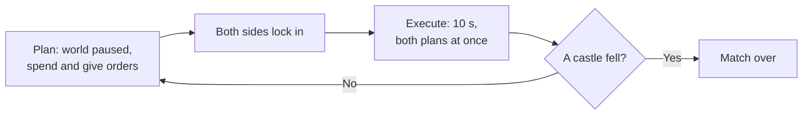
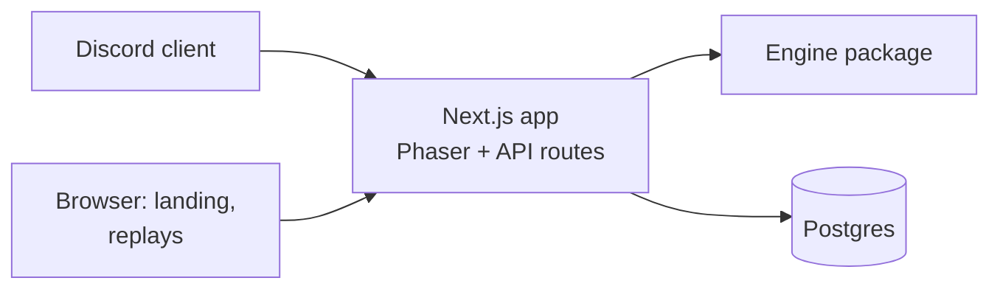

# Greyfall - Product Requirements Document

2026-09-21 · Wan · revised 2026-09-25: the game moves onto the strategic map as a turn-based war

## Overview

Greyfall is a Souls-themed strategy game that runs as a Discord Activity. Two sides share one island: each builds a town, trains an army from a fixed Warcraft-style roster, and fights for the island in simultaneous turns. Every turn both sides plan in secret while the world is paused, then both plans play out together for 10 seconds, and fights break out wherever armies meet. A match lasts about 15 minutes, works solo against an AI, and is the showcase project for Wan's full-stack skills.

**Goals**

- Ship a playable, polished game inside Discord that friends can launch from a voice call.
- Demonstrate full-stack depth: server-authoritative simulation, auth, persistence, matchmaking, deployment.
- Work with zero existing players, using an AI opponent that plays by the same rules.

**Non-goals**

- Live control: nothing is commanded while a turn executes. Turns are simultaneous, never real-time.
- Random shops, item systems, or monetisation in the MVP.
- Fog of war in the MVP; the whole island is visible while planning.
- Mobile-native apps outside Discord.
- Custom art beyond the Tiny Swords free pack and code-driven effects.
- Balance analytics and a simulation dashboard; possible after launch.

## Theme and setting

The world has been drained of colour by the Greying, a curse that hollows everything it touches. The player is the Keeper of the last bonfire, rebuilding a kingdom around its flame and pushing the grey back.

- **Colour as reward:** The island starts in greyscale. Colour returns to each region the player holds, so a won match looks like the bright original art.
- **Tone:** Sparse, melancholy writing in the style of FromSoft item descriptions, set against cheerful sprites.
- **Death screen:** "THE GREY TAKES YOU" when the player's castle falls.
- **Victory:** The land is reclaimed when the enemy castle falls.

**Covenants (factions)**

| Colour | Covenant | Identity |
| --- | --- | --- |
| Blue | Tidewardens | Protection and shields |
| Red | Emberkin | Fire and burn damage |
| Yellow | Dawnsworn | Healing and light |
| Purple | The Unwritten | Evasion; the order of Caedmon |
| Black | The Forsaken | Not playable in the MVP |

## Core gameplay loop

Each turn is plan, then execute. While planning, the world is frozen: the player spends gold and gives orders. When both sides lock in, both plans run at once for 10 seconds on the whole island, with no input. Then the world freezes again and the next turn begins. A match ends when a castle falls.

The planning phase has a 60-second timer in multiplayer and none in solo play. An execute phase lasts 10 seconds and can be sped up 2x. A match runs about 30 turns.

**Turn flow**

1. **Income:** base income arrives. Pawns deliver mined gold during execution, as it is carried home.
2. **Read the island:** every unit and building is visible, the enemy's included. The enemy's orders are not.
3. **Spend:** train units, train Pawns, build, upgrade.
4. **Order:** give each unit or group an order. Orders persist across turns until done or replaced, so a quiet turn is one click.
5. **Lock:** in solo, the AI has already planned. In a duel, execution starts when both players lock or the timer runs out.
6. **Execute:** 10 seconds of simulation. Units follow their orders and fight whatever they meet.

**Why simultaneous turns**

- The tension is prediction: you can see where the enemy is, but not where it is going. Holding a ramp, feinting at a mine, or pulling back a wounded group all depend on guessing the other plan.
- A fight can straddle turns. It pauses mid-swing, and the next plan decides whether to reinforce, retreat or commit. This is the moment the game is built around.
- Every decision is made with the clock stopped, so it stays a thinking game, playable on a phone inside Discord.

## Game systems

The full roster is always available, Warcraft-style; strategy comes from economy, supply, tech, position and counters instead of shop luck. All numbers below are starting values, kept in one config file for tuning.

### Orders

| Order | Who | Behaviour |
| --- | --- | --- |
| Attack-move | Fighters | Walk to a tile, fighting any enemy that comes in range. The default order. |
| Move | All | Walk to a tile, ignoring enemies. Used to retreat or to slip past. |
| Attack | Fighters | Walk to and attack a chosen unit or building. |
| Hold | Fighters | Stay put and fight whatever comes in range, without chasing. |
| Gather | Pawn | Mine a gold mine and carry gold to the castle, repeating. |
| Stop | All | Clear the order. An idle fighter defends within 3 tiles, then returns. |

Orders go to one unit or a selected group. A group order sends each unit along its own path to tiles around the target.

### The island

- A 32x20 grid of 64px tiles with three levels: water, lowland and plateau. Plateaus are reached only by ramps, so ramps are natural chokepoints.
- One unit per tile. All units walk 1 tile per second; crossing from one base to the other takes about 25 seconds, two to three turns.
- **High ground:** an attack from lowland against a unit on a plateau deals 25% less damage. No roll, so it stays deterministic.
- **Regions:** the island is divided into named regions (each plateau, each stretch of lowland). A player holds a region at the end of a turn if only their units stand in it. Held regions show in colour.
- **Gold mines:** one beside each base and one contested in the middle.

### Economy

- Starting gold: 10. Base income: 4 gold per turn. Unspent gold carries over.
- Pawns cost 2 gold and 1 supply. A gathering Pawn carries 1 gold per trip; a trip from the home mine takes about 8 seconds, so a Pawn earns a little over 1 gold per turn and pays for itself in about two turns.
- A mine takes up to 3 Pawns at once. Home mines hold 150 gold, the middle mine 300, so a long match has to fight over the middle.
- The trade-off: early Pawns make a stronger later army at the cost of a weaker early one.

### Supply

- Starting supply cap: 6. Every unit and Pawn uses 1 supply; a unit that dies frees its supply.
- A house costs 4 gold and adds 3 supply. Hard cap: 15 supply.

### Buildings and upgrades

Buildings unlock classes and upgrade them. Each goes on a fixed plot on its side's home plateau.

- Units trained while planning appear beside their building when execution starts.
- A new building or upgrade finishes at the end of the next execute phase.
- Buildings have HP and can be attacked. The castle has 600 HP, the rest 300. A destroyed building loses its levels and can be rebuilt on its plot.

| Building | Unlocks | Build cost | Level 2 | Level 3 |
| --- | --- | --- | --- | --- |
| Barracks | Warrior | Pre-built | 6 gold: +20% HP | 10 gold: Guard ability |
| Archery range | Archer | 4 gold | 6 gold: +1 range | 10 gold: piercing arrows |
| Tower | Lancer | 4 gold | 6 gold: +20% HP | 10 gold: Taunt ability |
| Monastery | Monk | 5 gold | 6 gold: +30% healing | 10 gold: revive one ally per turn |
| Castle | Level 3 upgrades | Pre-built | 8 gold: unlocks level 3 everywhere | None |
| House | +3 supply | 4 gold | None | None |

### Units

| Class | Cost (gold) | HP | Damage | Range (tiles) | Role |
| --- | --- | --- | --- | --- | --- |
| Pawn | 2 | 40 | 4 | 1 | Miner; weak filler if sent to fight |
| Warrior | 3 | 120 | 14 | 1 | Melee damage |
| Lancer | 3 | 140 | 10 | 1 | Front-line tank |
| Archer | 3 | 60 | 10 | 3 | Ranged damage |
| Monk | 4 | 70 | 0 | 2 | Heals the ally missing the most HP for 8 |

HP carries over between turns. Only Monks heal.

### Counters

- Lancer beats Warrior, Warrior beats Archer, Archer beats Lancer.
- A unit deals +25% damage to the class it counters.
- Monks counter nothing and are countered by nothing.

### Factions

The player picks one covenant at the start of a match; all their units use that colour. Each covenant has one passive, strengthened when the castle reaches level 2.

| Covenant | Passive | At castle level 2 |
| --- | --- | --- |
| Tidewardens (blue) | Units start each turn with a 15 HP shield | 25 HP shield |
| Emberkin (red) | Attacks burn for 3 damage per second over 3 seconds | 5 damage per second |
| Dawnsworn (yellow) | +20% healing received | +35% |
| The Unwritten (purple) | 10% chance to dodge attacks | 18% |

### Monster tribes

The other side of the island is the Greying's host, drawn from the pack's Enemy Pack. Knights and monsters are mirrors: each monster fills a knight class's role with the same cost, stats and counters, so the balance table stays one table and only the sprites differ. Knights grow stronger by upgrading buildings (same sprite); monsters grow stronger by mutating into a new body at the next tier.

Each covenant has a mirror tribe whose passive works the same way at the same strength:

| Role | Knights | Goblin Warband (mirrors Emberkin) | Tidal Brood (mirrors Tidewardens) | The Hollowed (mirrors Dawnsworn) | The Wilds (mirrors The Unwritten) |
| --- | --- | --- | --- | --- | --- |
| Melee | Warrior | Torch Goblin | Paddle Shark | Skull | Lizard |
| Tank | Lancer | Spear Goblin, then Pig Rider | Turtle | Minotaur | Panda |
| Ranged | Archer | Slingshot Gnome | Harpoon Shark | Gnoll | Giant Bat |
| Support | Monk | Imp | Bomb Fish | Hex Shaman | Spider |
| Worker | Pawn | Gnome | Gnome | Thief | Gnome |

| Tribe | Passive | Mirrors |
| --- | --- | --- |
| Goblin Warband | Attacks burn | Emberkin burn |
| Tidal Brood | Units start each turn with a shell that absorbs damage | Tidewardens shield |
| The Hollowed | Attacks drain health back to the attacker | Dawnsworn healing received |
| The Wilds | Chance to dodge attacks | Unwritten dodge |

**Buildings**

| Knight | Monster |
| --- | --- |
| Castle | Cave |
| Barracks | Goblin Hut |
| Archery range | Gnome Tower |
| Tower | Pirate Tower |
| Monastery | Dead Tree |
| House | Gnome Hut, Fish Hut |

Monster buildings come in one colour only, so restoring colour is the knights' reward alone.

**Left over:** Troll is the boss (its wind-up, recovery and death sheets make a telegraphed attack). Bear, Snake and Bumblebee are later tiers for the Wilds or neutral creep camps. Hex Shaman's Transformation Spell plus the Pig sprite is a ready-made Hex.

**Known gaps in the art**

- Only Gnoll, Harpoon Shark, Slingshot Gnome, Hex Shaman and Bomb Fish have projectiles; Giant Bat and Spider need their ranged and support effects drawn in code.
- No monster has gathering or carrying animations, so monster Pawns gather with a code-drawn sack over the run animation.
- Tanks with a guard sheet for Taunt: Turtle, Minotaur, Panda (Skull has one too, used for Guard). Spear Goblin and Pig Rider have none.

### Execution simulation

- Runs on the server at 10 ticks per second with a seeded random number generator. The same state, the same two sets of orders and the same seed always produce the same next state.
- The engine is `execute(state, ordersA, ordersB, seed)`: the new state plus an event log that the client plays back on the map.
- Movement follows the island's paths, ramps included. When two units want the same tile on the same tick, the one with the lower id takes it and the other waits.
- In combat, a unit targets the nearest enemy in range; ties go to the lowest HP, then tile. Each unit's first action in a turn is delayed by a seeded 0-1 s so armies do not swing in lockstep.
- Monks heal the ally missing the most HP in range.
- Abilities, one per class, unlocked by the level 3 upgrade (`BALANCE.abilities.*.enabled`):
  - Guard (Warrior): once per turn, below 50% HP, spends an action to take half damage for 3 seconds.
  - Taunt (Lancer): always on; enemies within 2 tiles must attack the nearest Lancer, and target anyone else only when no Lancer can be hit or reached.
  - Piercing (Archer): every 3rd shot also hits the enemy directly behind the target, along the line of fire, for half damage.
  - Revive (Monk): once per turn, spends an action raising the first ally to fall that turn, at 50% HP, if its tile is free.
- Random rolls are limited to dodge and burn procs.

### Win and lose

- A side loses when its castle is destroyed.
- After 40 turns the side with more castle HP wins; equal HP is a draw.

## Opponents

**AI (solo)**

The AI plans each turn with the same actions and rules as the player, and never sees the player's orders.

- Economy first: Pawns up to its home mine's limit, then houses as supply runs out.
- Builds and upgrades by its tribe's preferred army, with some seeded variation so no two matches open the same way.
- Attacks when its army's value is clearly larger than the player's visible army, defends when enemies step onto its plateau, and contests the middle mine when ahead.

**Duel**

Two players share an island, each planning in secret. The server resolves a turn when both lock in or the planning timer runs out; a player who never locks keeps their standing orders. The existing duel rooms (code, seats, deadline, one resolution per round) carry over unchanged in shape: a round becomes a turn.

## Discord and social

Greyfall launches from a Discord voice channel as an Activity. Everyone in the call can play solo against the AI or pair up for duels.

**Finding an opponent**

1. A player in the same Activity session who is also looking for a duel.
2. The AI, which is always available, so the game is fully playable with one player.

Saved phantom armies are dropped: a saved army cannot answer your moves turn by turn.

**Social features**

- Session results screen showing who beat whom, visible to everyone in the Activity.
- Shareable replay links; a replay is the starting state, the seed and every turn's orders. Posting one in chat unfurls into a preview card.
- A global leaderboard by fewest turns to beat the AI.

**Later, not MVP**

- Slash commands such as `/greyfall stats` and a daily seeded island with a server leaderboard.
- Lobby presence showing who is planning and who is watching a turn.
- Fog of war, with scouting as its counter.

## Art and assets

All art comes from the [Tiny Swords](https://pixelfrog-assets.itch.io/tiny-swords) free pack by Pixel Frog; missing animations are produced in code. The inventory below was checked against the files in [nauqh/pixel-knight](https://github.com/nauqh/pixel-knight).

**Asset use**

| Asset | Used for |
| --- | --- |
| Warrior, Lancer, Archer, Monk, Pawn in 5 colours | The 25 unit variants |
| Warrior guard, Lancer defence poses | Guard and Taunt abilities |
| Archer arrow, Monk heal effect | Projectiles and healing |
| Pawn tool animations (pickaxe, axe, hammer) | Mining and building on the island |
| 8 buildings in 5 colours | Buildings on their plots; each production building is its class's shop |
| Terrain tilesets, water, decorations, gold stones | The island, autotiled from its height map |
| Fire, explosion and dust effects | Deaths and burn damage |
| Ribbons, banners, bars, buttons, papers, wood table | All UI: the Warcraft-style HUD, HP bars, result banners |
| 25 human avatars | Unit portraits in the selection panel |

**Missing animations and code replacements**

- **Hit:** a 100 ms white flash plus a small shake, using Phaser tint and tweens.
- **Death:** tint grey, fade out while floating upward, and play a dust puff, read as a soul leaving.
- **Damage numbers:** pixel-font text that floats and fades.
- **Greyscale world:** a Phaser colour-matrix filter, lifted region by region as the player holds them.
- **Planned orders:** while planning, each selected unit shows its path and destination as a dotted line and flag.

**Technical notes**

- Lancer frames are 320px wide; other units are 192px. Normalise scale per class.
- Only the Lancer has directional poses. Other units face left or right by flipping horizontally.
- Animations run at 10 frames per second to match the pack.

**License**

- The current free pack allows commercial use and modification but forbids redistribution, so the files must not be in the public repo.
- Assets live in a private bucket and are downloaded during CI builds; the README tells contributors where to get them.
- The pixel-knight repo currently includes the pack files and should be fixed the same way, or switched to the CC0-licensed old version of the pack.

## Technical architecture

Greyfall is a TypeScript monorepo with one Next.js app and a shared game engine; the server is authoritative for every purchase and every turn.

**Stack**

| Layer | Choice | Notes |
| --- | --- | --- |
| Monorepo | pnpm workspaces | `packages/engine`, `apps/web` |
| Engine | Pure TypeScript, no dependencies | Island grid and pathing, economy, orders, execution, AI, seeded RNG |
| Tests | Vitest, fast-check | Unit tests and property tests on the engine |
| Client | Phaser inside Next.js | Loaded with `ssr: false`; destroyed on unmount |
| Discord | Embedded App SDK | OAuth sign-in; relative URLs for Discord's proxy |
| API | tRPC on Next.js, Zod | End-to-end types; Zod schemas as procedure inputs |
| Database | Postgres, Drizzle ORM | Neon serverless driver if on Vercel |
| Hosting | Railway | One long-running Next.js server; Vercel as alternative |
| CI | GitHub Actions | Type check, tests, build; assets pulled from a private bucket |

**Key rules**

- The engine is a pure function: state plus both sides' orders in, new state plus events out. The client never decides outcomes.
- Planning actions (train, build, upgrade, order) are validated by the engine on the client for instant feedback and again on the server.
- Execution returns an event log (`move`, `attack`, `hit`, `heal`, `death`, `burn`, `gather`, `build`) that the client plays back on the map.
- The island's grid and pathing live in the engine, not the client, so the server can run a turn.

**Data model**

| Table | Key fields |
| --- | --- |
| `players` | `id`, `discord_id`, `display_name`, `created_at` |
| `matches` | `id`, `mode` (solo or duel), `seed`, `status`, `turn`, `covenants`, `state_json`, `deadline` |
| `match_turns` | `match_id`, `turn`, `orders_a`, `orders_b` |
| `match_players` | `match_id`, `side`, `player_id` |

A replay needs only a match's seed, its starting state and its `match_turns` rows.

**API**

The game API is a tRPC router mounted at `/api/trpc`, a relative URL that works through Discord's proxy. The React UI uses the tRPC React hooks; Phaser scenes use the vanilla tRPC client, still fully typed. Every procedure validates input with Zod and runs game logic through the engine.

| Procedure | Type | Purpose |
| --- | --- | --- |
| `match.start` | Mutation | Start a solo match or open a duel, with a chosen covenant |
| `match.get` | Query | Current state, turn and deadline |
| `match.plan` | Mutation | Submit this turn's purchases and orders; validated by the engine |
| `match.lock` | Mutation | Lock in; the turn executes when both sides have |
| `replay.get` | Query | Replay data by match id |
| `leaderboard.list` | Query | Global leaderboard |

Match procedures are protected: they require the session created at sign-in.

**Plain routes (not tRPC)**

| Route | Why plain |
| --- | --- |
| `POST /api/auth/token` | Discord OAuth code exchange; matches Discord's official examples |
| `/replay/[id]` page | Clean shareable URL and preview image; loads data with a server-side tRPC caller |

**Public pages**

- `/` landing page for recruiters and players.
- `/replay/[id]` with a generated preview image for link unfurls.
- `/leaderboard`.

## MVP scope and plan

The battle prototype is done and stays playable (Solo and Duel on their own battle board) until the war on the map replaces it; then it is removed. The strategic map exists as a look-and-move scene: the island, both bases, wandering garrisons, a Warcraft-style HUD with placeholder values. The war is built as new code on that map, reusing the engine's balance table, the sprites, terrain and UI, and the hit and death effects.

**Phase 2: Solo war on the island, about 3 weeks**

- The engine gains the island grid, orders, economy, buildings and `execute()`, tested headless with a CLI that prints a turn, before any screen.
- The map gains selection, orders with drawn paths, a live HUD (gold, supply), building menus in the command card, and playback of each execute phase.
- One fixed covenant against one fixed tribe, and a simple AI.

Out of Phase 2: covenants and tribes beyond one pair, level 3 abilities, region colour, duels, Discord, persistence.

**Milestones**

| Phase | Weeks | Milestone | Done when |
| --- | --- | --- | --- |
| 1 | Done | Battle prototype | Army picker, battle board, playback, duel rooms |
| 2 | 1 | Engine war core | Island grid and pathing, orders, economy, `execute()` and the AI work headless; a CLI prints a turn; determinism and invariant tests pass |
| 2 | 2-3 | War on the map | Plan and execute on the island: train, build, order, watch; castle win and loss; solo against the AI in the browser |
| 3 | 4-6 | Full game | Covenants and tribes, upgrades and abilities, region colour, duels on the island; tRPC server and Postgres; old battle board removed |
| 4 | 7-9 | Discord and launch | Activity with Discord sign-in, replay page, leaderboard, greyscale polish, sound, production deploy |

**Success metrics**

- A new player finishes a first match without explanation.
- 5 friends play in one Discord call.
- Engine test coverage above 90%.
- A case-study write-up and a 2-minute demo video on the landing page.

**Risks**

| Risk | Mitigation |
| --- | --- |
| Scope creep in content | Freeze the roster at 5 classes until launch |
| Turn length feels wrong | One number in `balance.ts`; playtest 8, 10 and 15 seconds in week 2 |
| Crowding and pathing on a one-unit-per-tile grid | Build and test the engine headless first; watch it in the CLI before the map plays it |
| Too many units to order each turn | Orders persist across turns; group selection; idle fighters defend on their own |
| The AI is trivial or unbeatable | Rule-based and tuned by numbers in `balance.ts`; later, difficulty as an income bonus |
| Discord proxy or CSP issues | Build a placeholder Discord shell early in Phase 3 |
| Asset license breach | Private bucket and CI download from day one |

**Open questions**

- Is 10 seconds the right execute length, and should an execute phase end early when a fight starts?
- Should a player see a preview of their own plan (a ghost run of their units only) before locking in?
- In a duel, does the second player play a monster tribe, or do both play knights in different colours?
- One match, or a run of several islands with humanity as the run's lives?
- Fixed building plots, or free placement on the home plateau?
- Can players hire units from other covenants as mercenaries at a higher cost?
- Should the Forsaken (black) become a fifth playable covenant?
- Final name check against Steam, itch.io and the Discord app directory.
