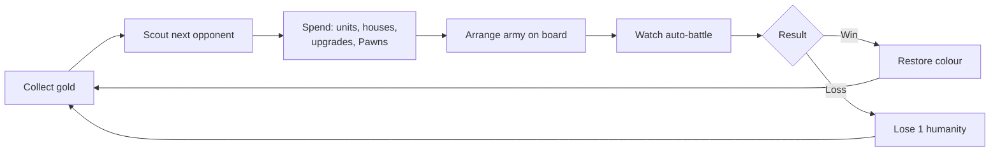
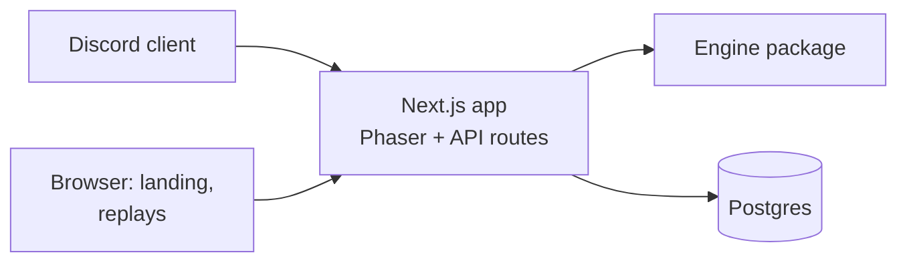

# Greyfall — Product Requirements Document

2026-09-21 · Wan

## Overview

Greyfall is a Souls-themed auto-battler that runs as a Discord Activity: players build a town, buy an army from a fixed Warcraft-style roster, arrange it on a board, and watch it fight saved armies of other players. A run lasts about 15 minutes, works solo, and is the showcase project for Wan's full-stack skills.

**Goals**

- Ship a playable, polished game inside Discord that friends can launch from a voice call.
- Demonstrate full-stack depth: server-authoritative simulation, auth, persistence, matchmaking, deployment.
- Work with zero existing players, using phantom armies and AI-built fallback armies.

**Non-goals**

- Real-time multiplayer or live head-to-head matches.
- Random shops, item systems, or monetisation in the MVP.
- Mobile-native apps outside Discord.
- Custom art beyond the Tiny Swords free pack and code-driven effects.
- Balance analytics and a simulation dashboard; possible after launch.

## Theme and setting

The world has been drained of colour by the Greying, a curse that hollows everything it touches. The player is the Keeper of the last bonfire, rebuilding a kingdom around its flame and pushing the grey back.

- **Colour as reward:** The town starts in greyscale. Each victory restores colour to buildings, terrain and units, so a finished run looks like the bright original art.
- **Tone:** Sparse, melancholy writing in the style of FromSoft item descriptions, set against cheerful sprites.
- **Death screen:** "THE GREY TAKES YOU" when the run ends.
- **Victory:** The land is reclaimed after 10 round wins.

**Covenants (factions)**

| Colour | Covenant | Identity |
| --- | --- | --- |
| Blue | Tidewardens | Protection and shields |
| Red | Emberkin | Fire and burn damage |
| Yellow | Dawnsworn | Healing and light |
| Purple | The Unwritten | Evasion; the order of Caedmon |
| Black | The Hollowed | Not playable in the MVP |

## Core gameplay loop

Each round is plan, then watch: all decisions happen before the battle, and the battle shows whether they were good. A run is up to 14 rounds and ends at 10 wins or 0 humanity.

The planning phase has a 60-second timer in multiplayer sessions and none in solo play. Battles last about 20 seconds and can be sped up 2x.

**Round flow**

1. **Collect gold:** base income plus mining income from Pawns.
2. **Scout:** see the next opponent's army composition, but not its positions.
3. **Spend:** buy units, build houses for supply, upgrade buildings, or train Pawns.
4. **Arrange:** place units on a 4x3 board.
5. **Battle:** units fight automatically; the player only watches.
6. **Result:** a win restores colour to part of the town; a loss costs 1 humanity.

Every battle is two armies: the player's against one opponent army, which is always a phantom or an AI-built army. There are no boss rounds.

## Game systems

The full roster is always available, Warcraft-style; strategy comes from economy, supply, tech and counters instead of shop luck. All numbers below are starting values, kept in one config file for tuning.

### Economy

- Base income: 10 gold per round. Unspent gold carries over.
- Pawns cost 2 gold and 1 supply. Each Pawn assigned to mining adds 2 gold per round and does not fight.
- The trade-off: early Pawns make a stronger late army at the cost of weaker early rounds.

### Supply

- Starting supply cap: 6. Every unit and Pawn uses 1 supply.
- A house costs 4 gold and adds 3 supply. Hard cap: 15 supply.
- The board holds up to 12 units.

### Buildings and upgrades

Buildings unlock classes and upgrade them. Upgrades replace the merge mechanic of standard auto-battlers.

| Building | Unlocks | Build cost | Level 2 | Level 3 |
| --- | --- | --- | --- | --- |
| Barracks | Warrior | Pre-built | 6 gold: +20% HP | 10 gold: Guard ability |
| Archery range | Archer | 4 gold | 6 gold: +1 range | 10 gold: piercing arrows |
| Tower | Lancer | 4 gold | 6 gold: +20% HP | 10 gold: Taunt ability |
| Monastery | Monk | 5 gold | 6 gold: +30% healing | 10 gold: revive one ally per battle |
| Castle | Level 3 upgrades | Pre-built | 8 gold: unlocks level 3 everywhere | None |
| House | +3 supply | 4 gold | None | None |

### Units

| Class | Cost (gold) | HP | Damage | Range (tiles) | Role |
| --- | --- | --- | --- | --- | --- |
| Pawn | 2 | 40 | 4 | 1 | Miner; weak filler if placed on the board |
| Warrior | 3 | 120 | 14 | 1 | Melee damage |
| Lancer | 3 | 140 | 10 | 1 | Front-line tank |
| Archer | 3 | 60 | 10 | 3 | Ranged damage |
| Monk | 4 | 70 | 0 | 2 | Heals the ally missing the most HP for 8 |

### Counters

- Lancer beats Warrior, Warrior beats Archer, Archer beats Lancer.
- A unit deals +25% damage to the class it counters.
- Monks counter nothing and are countered by nothing.

### Factions

The player picks one covenant at the start of a run; all their units use that colour. Each covenant has one passive, strengthened when the castle reaches level 2.

| Covenant | Passive | At castle level 2 |
| --- | --- | --- |
| Tidewardens (blue) | Units start battle with a 15 HP shield | 25 HP shield |
| Emberkin (red) | Attacks burn for 3 damage per second over 3 seconds | 5 damage per second |
| Dawnsworn (yellow) | +20% healing received | +35% |
| The Unwritten (purple) | 10% chance to dodge attacks | 18% |

### Scouting

Before arranging, the player sees the next opponent's covenant, unit counts per class and building levels. Positions stay hidden.

### Battle simulation

- Runs on the server at 10 ticks per second with a seeded random number generator; the same armies and seed always produce the same result.
- Units target the nearest enemy; ties go to the lowest HP, then board position. Each unit's first action is delayed by a seeded 0-1 s so armies do not swing in lockstep.
- Monks heal the ally missing the most HP in range.
- Abilities, one per class. Until buildings exist every unit has its own; the level 3 upgrade will gate it later (`BALANCE.abilities.*.enabled`):
  - Guard (Warrior): once per battle, below 50% HP, spends an action to take half damage for 3 seconds.
  - Taunt (Lancer): always on; enemies within 2 tiles must attack the nearest Lancer, and target anyone else only when no Lancer can be hit or reached.
  - Piercing (Archer): every 3rd shot also hits the enemy directly behind the target, in the same row, for half damage.
  - Revive (Monk): once per battle, spends an action raising the first ally to fall, at 50% HP, if its tile is free.
- Random rolls are limited to dodge and burn procs.
- A battle times out after 45 seconds; the side with more total HP remaining wins.

### Win and lose

- Humanity: 5 at the start; a loss costs 1. At 0 the run ends.
- Victory: 10 round wins. A run lasts at most 14 rounds.

## Discord and social

Greyfall launches from a Discord voice channel as an Activity. Everyone in the call plays their own run at the same time and is matched against each other's saved armies, so the session feels shared without live syncing.

**Phantoms**

- After each round's planning phase, the player's army is saved as a phantom: units, positions, covenant, building levels and round number.
- Opponents are always phantoms, never live players.

**Matchmaking order for each round**

1. A phantom from a player in the same Activity session, at the same round.
2. A phantom from the global pool at the same round with a similar win record.
3. An AI-built army generated from the same rules, as a fallback when no phantom exists.

This order means the game is fully playable with one player.

**Social features**

- Session results screen showing who beat whom, visible to everyone in the Activity.
- Shareable replay links; posting one in chat unfurls into a preview card showing both armies.
- A global leaderboard by fastest victory and fewest humanity lost.

**Later, not MVP**

- Slash commands such as `/greyfall stats` and a daily seeded run with a server leaderboard.
- Lobby presence showing who is in the planning or battle phase.

## Art and assets

All art comes from the [Tiny Swords](https://pixelfrog-assets.itch.io/tiny-swords) free pack by Pixel Frog; missing animations are produced in code. The inventory below was checked against the files in [nauqh/pixel-knight](https://github.com/nauqh/pixel-knight).

**Asset use**

| Asset | Used for |
| --- | --- |
| Warrior, Lancer, Archer, Monk, Pawn in 5 colours | The 25 unit variants |
| Warrior guard, Lancer defence poses | Guard and Taunt abilities |
| Archer arrow, Monk heal effect | Projectiles and healing |
| Pawn tool animations (pickaxe, axe, hammer) | Mining and building in the town screen |
| 8 buildings in 5 colours | Town screen; each production building is its class's shop |
| Terrain tilesets, water, decorations, gold stones | Town and battle backgrounds |
| Fire, explosion and dust effects | Deaths and burn damage |
| Ribbons, banners, bars, buttons, papers, wood table | All UI: shop, HP bars, result banners |
| 25 human avatars | Unit portraits on shop cards |

**Missing animations and code replacements**

- **Hit:** a 100 ms white flash plus a small shake, using Phaser tint and tweens.
- **Death:** tint grey, fade out while floating upward, and play a dust puff, read as a soul leaving.
- **Damage numbers:** pixel-font text that floats and fades.
- **Greyscale world:** a Phaser colour-matrix filter, lifted region by region as colour is restored.

**Technical notes**

- Lancer frames are 320px wide; other units are 192px. Normalise scale per class.
- Only the Lancer has directional poses. Other units face left or right by flipping horizontally.
- Animations run at 10 frames per second to match the pack.

**License**

- The current free pack allows commercial use and modification but forbids redistribution, so the files must not be in the public repo.
- Assets live in a private bucket and are downloaded during CI builds; the README tells contributors where to get them.
- The pixel-knight repo currently includes the pack files and should be fixed the same way, or switched to the CC0-licensed old version of the pack.

## Technical architecture

Greyfall is a TypeScript monorepo with one Next.js app and a shared game engine; the server is authoritative for every purchase and battle.

**Stack**

| Layer | Choice | Notes |
| --- | --- | --- |
| Monorepo | pnpm workspaces | `packages/engine`, `apps/web` |
| Engine | Pure TypeScript, no dependencies | Simulation, economy, stats, seeded RNG |
| Tests | Vitest, fast-check | Unit tests and property tests on the engine |
| Client | Phaser inside Next.js | Loaded with `ssr: false`; destroyed on unmount |
| Discord | Embedded App SDK | OAuth sign-in; relative URLs for Discord's proxy |
| API | tRPC on Next.js, Zod | End-to-end types; Zod schemas as procedure inputs |
| Database | Postgres, Drizzle ORM | Neon serverless driver if on Vercel |
| Hosting | Railway | One long-running Next.js server; Vercel as alternative |
| CI | GitHub Actions | Type check, tests, build; assets pulled from a private bucket |

**Key rules**

- The engine is a pure function: state plus actions in, new state plus events out. The client never decides outcomes.
- Battles return an event log (`attack`, `hit`, `heal`, `death`, `burn`) that the client plays back as animations.
- The engine is imported by the client for previews and by the server for official results, so both always agree.

**Data model**

| Table | Key fields |
| --- | --- |
| `players` | `id`, `discord_id`, `display_name`, `created_at` |
| `runs` | `id`, `player_id`, `covenant`, `seed`, `status`, `round`, `wins`, `humanity`, `gold`, `state_json` |
| `army_snapshots` | `id`, `run_id`, `round`, `wins`, `covenant`, `army_json`, `buildings_json` |
| `battles` | `id`, `run_id`, `round`, `snapshot_a`, `snapshot_b`, `seed`, `winner` |

A replay needs only a `battles` row: two snapshots plus the seed.

**API**

The game API is a tRPC router mounted at `/api/trpc`, a relative URL that works through Discord's proxy. The React UI uses the tRPC React hooks; Phaser scenes use the vanilla tRPC client, still fully typed. Every procedure validates input with Zod and runs game logic through the engine.

| Procedure | Type | Purpose |
| --- | --- | --- |
| `run.start` | Mutation | Start a run with a chosen covenant |
| `run.get` | Query | Current run state |
| `run.action` | Mutation | Buy, build, upgrade, train Pawn, sell; validated by the engine |
| `run.arrange` | Mutation | Submit board positions |
| `run.scout` | Query | Next opponent's composition |
| `run.battle` | Mutation | Match a phantom, simulate, return the event log |
| `replay.get` | Query | Replay data by battle id |
| `leaderboard.list` | Query | Global leaderboard |

Run procedures are protected: they require the session created at sign-in.

**Plain routes (not tRPC)**

| Route | Why plain |
| --- | --- |
| `POST /api/auth/token` | Discord OAuth code exchange; matches Discord's official examples |
| `/replay/[id]` page | Clean shareable URL and preview image; loads data with a server-side tRPC caller |

**Public pages**

- `/` landing page for recruiters and players.
- `/replay/[id]` with a generated preview image for link unfurls.
- `/leaderboard`.

## MVP scope and plan

The first MVP is a battle prototype: the player picks an army, places it, and watches it fight an AI army in the browser. Town building, economy, Discord and the server come in later phases.

**Phase 1: Battle prototype (MVP), about 3 weeks**

- The player gets a fixed gold budget (20 gold to start, set in `balance.ts`) and picks units from the full roster: Warrior, Lancer, Archer, Monk.
- The player places units on the 4x3 board.
- An AI-built army of the same budget is generated as the opponent.
- The battle plays back with animations, hit and death effects, and HP bars.
- A result screen shows win or loss, with Rematch (same armies, new seed) and New army buttons.
- The engine runs in the browser for this phase; no server, database or sign-in. Because the engine is pure, it moves to the server unchanged in Phase 2.

Out of Phase 1: town, buildings, upgrades, economy, Pawns, supply, covenants, scouting, runs, humanity, Discord, persistence.

**Milestones**

| Phase | Weeks | Milestone | Done when |
| --- | --- | --- | --- |
| 1 | 1 | Engine battle core | `balance.ts`, seeded RNG, `simulate()` and `generateArmy()` work; a CLI prints a battle; determinism and invariant tests pass |
| 1 | 2–3 | Web client | Army picker with budget, board placement, battle playback with effects, result screen with rematch, all in the browser |
| 2 | 4–6 | Full game | Town screen, economy, supply, buildings and upgrades, covenants, scouting, runs and humanity; tRPC server and Postgres |
| 3 | 7–9 | Discord and launch | Activity with Discord sign-in, phantom matchmaking, replay page, leaderboard, greyscale polish, sound, production deploy |

**Success metrics**

- A new player finishes a first run without explanation.
- 5 friends play a full session in one Discord call.
- Engine test coverage above 90%.
- A case-study write-up and a 2-minute demo video on the landing page.

**Risks**

| Risk | Mitigation |
| --- | --- |
| Scope creep in content | Freeze the roster at 5 classes until launch |
| Discord proxy or CSP issues | Build a placeholder Discord shell early in Phase 2 |
| Balance feels solved without randomness | Scouting, varied phantoms and faction choice; watch pick rates in playtests |
| Asset license breach | Private bucket and CI download from day one |
| Missing animations look cheap | Prototype the hit and death effects in week 3 before building more |

**Open questions**

- Can players hire units from other covenants as mercenaries at a higher cost?
- Should the Hollowed (black) become a fifth playable covenant?
- Is a daily seeded run worth adding right after launch?
- Final name check against Steam, itch.io and the Discord app directory.
