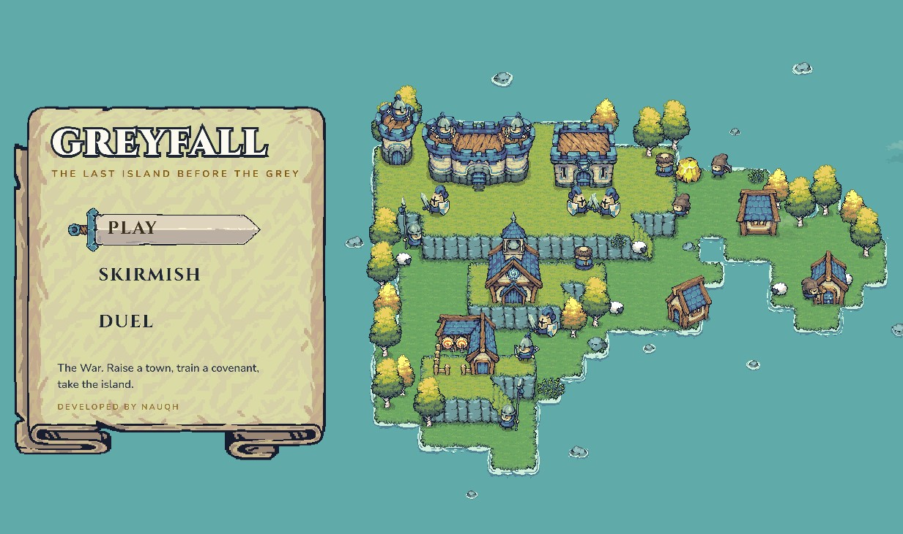

<div align="center">

# Greyfall

**A small real-time strategy game, built to run inside Discord.**

[](https://github.com/nauqh/greyfall/actions/workflows/ci.yml)




</div>

Raise a town on your plateau, send Pawns to dig gold, train an army, and take
the island before the monsters take your hall.

Greyfall is a town and an army on a tiny island, played in the browser and
drawn entirely with Pixel Frog's
[Tiny Swords](https://pixelfrog-assets.itch.io/tiny-swords) pack. It is headed
for Discord as an Activity that friends launch from a voice call.

## Highlights

- Real-time war on a mirrored two-lane island, three levels high. The High
  Pass runs under the Crown's high ground; the Low Road leads to the rich mine
  at the ford.
- Fog of war in two layers, black until explored and grey out of
  sight. Nobody sees up a cliff.
- Pawns carry gold from mine to castle, 10 a trip, and buildings go
  anywhere legal, counting down from the moment they are placed.
- Five classes, Pawn, Warrior, Lancer, Archer and Monk, with a counter
  triangle, training queues, rally points and control groups.
- Every match ends: from minute 4 a monster wave comes down from the Crown
  every minute, bigger each time, and goes for whoever is nearest. Kills pay
  a bounty.
- A deterministic engine. The same state, commands and seed always give the
  same world, so a replay is a seed plus the commands.

## Current state

The real-time war is playable solo, blue knights against a red AI clan. It is
not in Discord yet and has no multiplayer on the island. Red wins more often
than it should, and the AI still plans with logic written for the older
rounds mode.

Two earlier modes still ship and will be replaced by multiplayer on the
island: **Skirmish**, an auto-battler where you draft an army and watch it
fight, and **Duel**, the same board against a friend.

## Goals

- Balance the war and give the AI real-time play of its own.
- Lockstep multiplayer on the island. The engine already takes commands
  between ticks, so this adds networking without touching the rules.
- Server-authoritative matches, with fog filtered per player and saved games.
- Launch as a Discord Activity with Discord sign-in, shareable replays and a
  leaderboard.
- A minimap, sound and polish.

The design and the reasoning behind it are in [PRD.md](PRD.md) (the original
rounds design), [RTS.md](RTS.md) (the move to real time) and
[ENHANCE.md](ENHANCE.md) (the island plan, partly superseded).

## Play

| Mode | Route | |
| --- | --- | --- |
| Play | `/map` | The real-time war against the AI |
| Skirmish | `/battle` | Draft within a gold budget, watch the fight |
| Duel | `/duel` | Skirmish against a friend via a room code |

Left click selects, right click orders. Space pauses, and **H** opens the
field guide, which lists every shortcut.

## Getting started

You need Node 24 and pnpm 10, plus AWS credentials that can read the art pack.
The pack's license forbids redistribution, so it is not in this repository; it
lives in a private S3 object and each machine fetches its own copy.

```bash
git clone https://github.com/nauqh/greyfall.git
cd greyfall
pnpm install
cp apps/web/.env.example apps/web/.env   # TINY_SWORDS_S3 is already set
pnpm dev                                 # fetches the pack, then starts Next
```

Duel also needs `DATABASE_URL` (a Neon pooled connection string) in
`apps/web/.env` and `pnpm --filter @greyfall/web db:push` once.

Other scripts:

```bash
pnpm test                         # engine unit and property tests
pnpm typecheck                    # both packages
pnpm test:assets                  # every sprite path the game asks for exists
pnpm war -- --realtime --seed 3   # a real-time war, AI against AI, in the terminal
pnpm war -- --map                 # print the island
pnpm battle -- --seed 7 --moves   # one Skirmish battle in the terminal
pnpm assets                       # fetch and unpack the art pack
```

The CLIs need no art, so they are the quickest check that the engine works.

## Troubleshooting

**Blank board, 404s for `/tiny-swords/...`.** The art pack is missing. Check
`TINY_SWORDS_S3` and your AWS credentials, then run `pnpm assets`.

**`Region is missing`.** The SDK found no region. Set `AWS_REGION` or a
region in `~/.aws/config`.

**`Invalid character in header content`.** A placeholder AWS value is set in
`.env`. Leave those variables unset locally so `~/.aws` is used.

## Deployment

<details>
<summary>Environment variables and host setup</summary>

Set these in the host's environment (on Vercel, Project Settings >
Environment Variables), not in a file:

| Variable | Value |
| --- | --- |
| `TINY_SWORDS_S3` | `s3://greyfall-assets/tiny-swords/tiny-swords.zip` |
| `AWS_ACCESS_KEY_ID` | the deploy user's key |
| `AWS_SECRET_ACCESS_KEY` | its secret |
| `AWS_REGION` | `ap-southeast-1` |
| `DATABASE_URL` | for Duel |

- On Vercel, set the Root Directory to `apps/web`. A missing `TINY_SWORDS_S3`
  fails the build there rather than shipping a game with no art;
  `pnpm assets --require` does the same anywhere.
- The fetch script lives in `apps/web/scripts/`, because Vercel's Root
  Directory forbids reaching outside it with `..`. That once shipped a build
  with no art and no error.
- Give the deploy its own IAM user scoped to `s3:GetObject` on that one key.
- The SDK signs each request on purpose: a public object would be a
  redistributable copy, and a presigned URL expires within 7 days.
- CI needs none of this: the build never reads the art.
- Every pack request goes through `packUrl`, prefixed by
  `NEXT_PUBLIC_ASSET_BASE` (default `/tiny-swords`). A Discord Activity is
  proxied and needs `/.proxy/tiny-swords`.

There is one pack, `tiny-swords.zip`, zipped from the `tiny-swords/` folder at
the repo root. To change it, overwrite that object; `pnpm assets` (and so
`pnpm dev`) notices the new ETag and fetches it again:

```bash
powershell -Command "Compress-Archive -Force -Path tiny-swords\* -DestinationPath tiny-swords.zip"
aws s3 cp tiny-swords.zip s3://greyfall-assets/tiny-swords/tiny-swords.zip
```

</details>

## Technical foundation

| | |
| --- | --- |
| Engine | TypeScript with no dependencies, tested with Vitest and fast-check |
| Client | Next.js 15, React 19, Phaser 3.90 |
| API and data | tRPC, Zod, Drizzle ORM, Neon Postgres |
| Tooling | pnpm workspaces, GitHub Actions |

```
packages/engine   the simulation: island, pathing and vision, the tick-stepped
                  war (createSim, actions, economy, AI), the Skirmish battle,
                  balance tables, seeded rng, and the two CLIs
apps/web          the Next.js app: Phaser scenes for the title, the island and
                  the Skirmish board; React menus; tRPC and Drizzle for Duel
```

The engine steps at 10 ticks a second and touches no I/O, so the same code
can run on a server and keep every player's view in agreement.

## Special thanks

- Pixel Frog, for Tiny Swords.
- [1500 Archers on a 28.8](https://www.gamedeveloper.com/programming/1500-archers-on-a-28-8-network-programming-in-age-of-empires-and-beyond)
  and [Fix Your Timestep!](https://gafferongames.com/post/fix_your_timestep/),
  the models the engine is built on.
